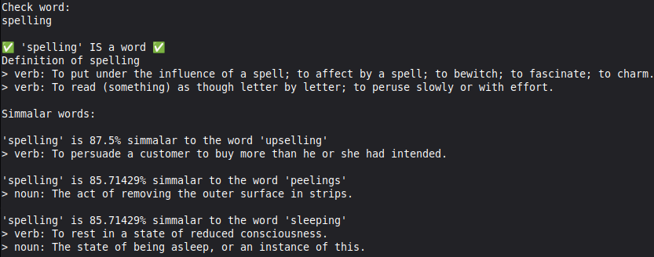

# SpellCLI
A CLI that allows you to check the spelling of different words.

# Features
- Check if a word is spelled correctly
- Get the definition of a word
- Get words with similar spelling
- Get the definition of words with similar spelling
- Get the time the program takes to run (only in `--debug`) 
  
# Spell check
Input a word to check it's spelling.


<!-- the program is not on crates.io yet
# Install
This program can be installed with:
```bash
cargo install spellcli
```
_[cargo needs to be installed first.](https://rust-lang.org/tools/install/)_
-->
# AI Usage
AI was not used in any way toward the creation of this project.